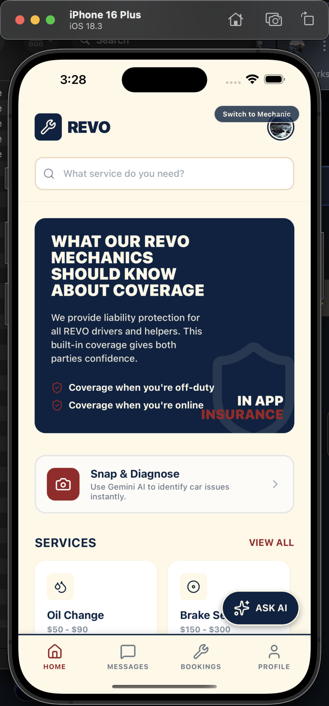
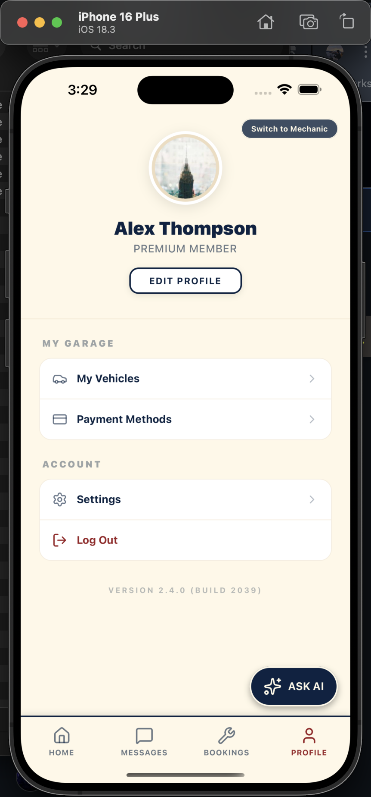
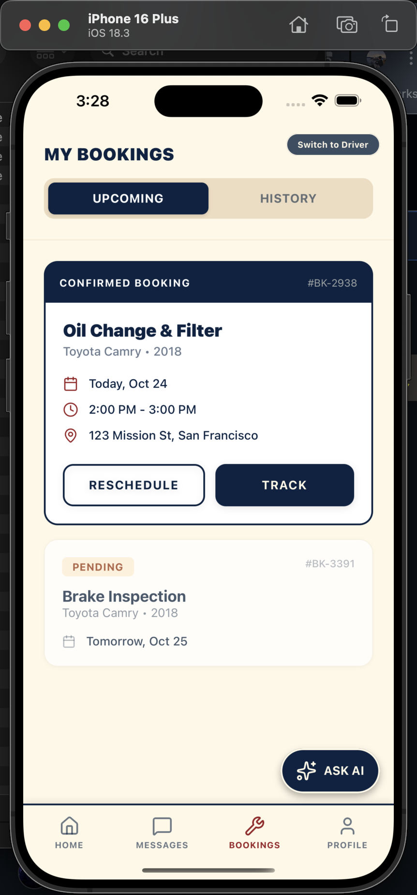
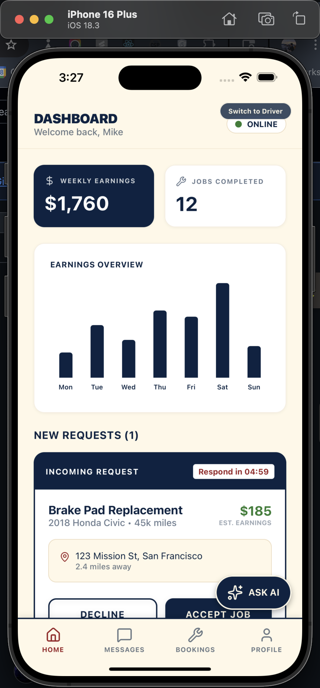
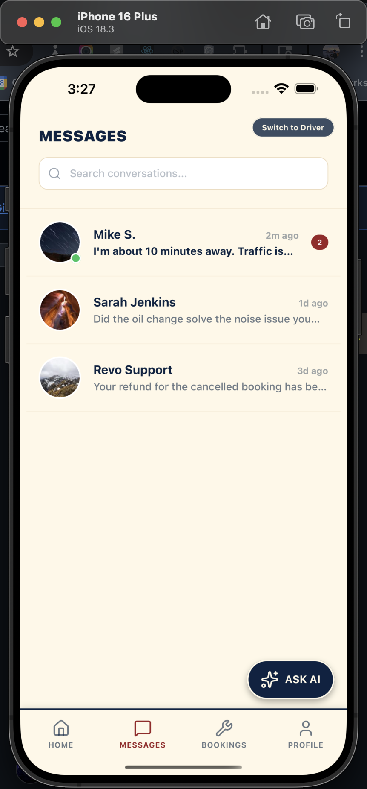
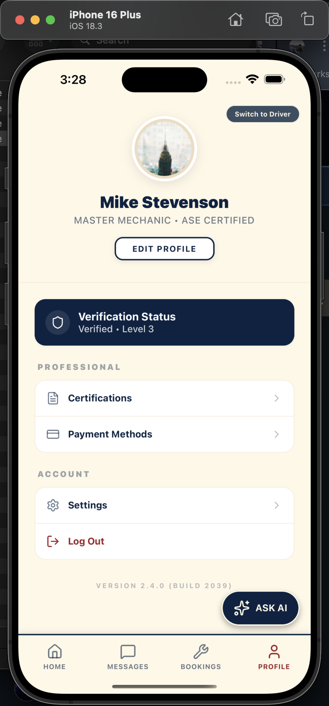

# REVO: Uber for Mechanics

**REVO** is an early-stage proof-of-concept for a two-sided marketplace that connects drivers with nearby mechanics on demand. Think of it like Uber, but instead of rides, you're getting roadside or shop-based mechanical help, fast, transparent, and on your schedule.

This prototype demonstrates the core flow for both sides of the marketplace: drivers requesting service and mechanics managing their availability, bookings, and earnings.

## Demo

### Driver Experience

| Home | Profile |
|------|---------|
|  |  |

### Mechanic Experience

| Bookings | Earnings |
|----------|---------|
|  |  |

| Messages | Profile |
|----------|---------|
|  |  |

## What REVO Does

- **For Drivers:** Find and book a mechanic nearby, track job status, and manage your vehicle service history in one place.
- **For Mechanics:** Accept jobs, manage your schedule, communicate with customers, and track your earnings, all from a mobile app.
- **For the Market:** REVO sits in the middle, handling discovery, trust, and transactions so neither side has to.

This is a super early prototype built to validate the concept and demonstrate the core user journeys before building out the full platform.

## Getting Started

### Prerequisites

- [Node.js](https://nodejs.org/) (v18+)
- [Expo Go](https://expo.dev/go) app on your phone, or an iOS/Android simulator

### Install & Run

```bash
# Install dependencies
npm install

# Start the dev server
npx expo start
```

Then scan the QR code with **Expo Go** on your phone, or press:
- `i` to open in iOS Simulator
- `a` to open in Android Emulator

### Switching User Roles

The app supports two roles, **Driver** and **Mechanic**. You can switch between them from the login/onboarding screen to explore both sides of the marketplace.
